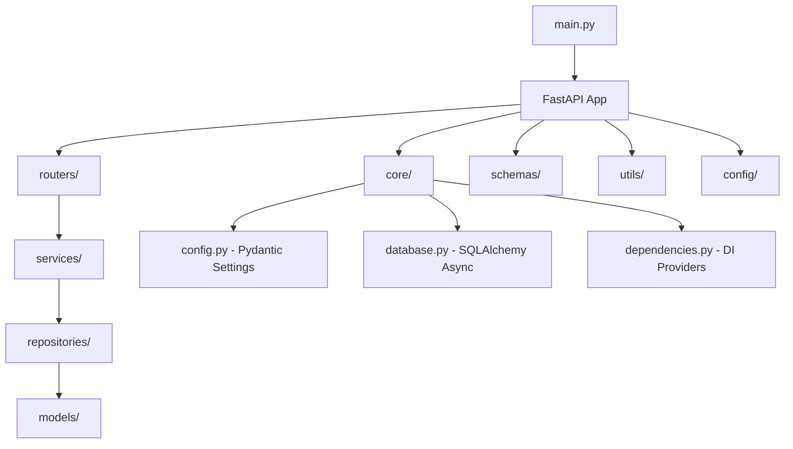

# FastAPI Family Storage Application Architecture Plan

## Overview
This plan outlines the project structure for the FastAPI Family Storage application, following Clean Architecture principles. The structure separates concerns into layers: presentation (routers), business logic (services), data access (repositories), and infrastructure (models, schemas, config, core, utils).

## Key Principles
- **Clean Architecture**: Separation of concerns with clear layer boundaries
- **Async Operations**: All database and service operations designed for async/await
- **Dependency Injection**: Using FastAPI's dependency system for inversion of control
- **Scalability**: Modular structure allowing easy addition of features
- **Environment Configuration**: Pydantic-settings for type-safe, environment-based config

## Project Structure
```
family-storage-backend/
├── main.py                    # Application entry point
├── app/
│   ├── __init__.py
│   ├── core/
│   │   ├── __init__.py
│   │   ├── config.py          # Core configuration settings
│   │   ├── database.py        # Database connection and session management
│   │   └── dependencies.py    # Dependency injection providers
│   ├── models/
│   │   ├── __init__.py
│   │   └── # Database models (e.g., user.py, file.py)
│   ├── schemas/
│   │   ├── __init__.py
│   │   └── # Pydantic schemas (e.g., user.py, file.py)
│   ├── repositories/
│   │   ├── __init__.py
│   │   └── # Data access layer (e.g., user_repository.py)
│   ├── services/
│   │   ├── __init__.py
│   │   └── # Business logic (e.g., user_service.py, file_service.py)
│   ├── routers/
│   │   ├── __init__.py
│   │   └── # API endpoints (e.g., users.py, files.py)
│   ├── config/
│   │   ├── __init__.py
│   │   └── # Application-specific configuration
│   └── utils/
│       ├── __init__.py
│       └── # Utility functions and helpers
```

## Architecture Diagram


## Layer Responsibilities
- **routers/**: API endpoints, request/response handling
- **services/**: Business logic, use cases, domain rules
- **repositories/**: Data access abstraction, database operations
- **models/**: Database table definitions (SQLAlchemy)
- **schemas/**: Request/response validation (Pydantic)
- **core/**: Core application setup, config, database, dependencies
- **config/**: Application-specific settings
- **utils/**: Shared utility functions

## Configuration Setup
- Use `pydantic-settings` for environment-based configuration
- Support multiple environments (dev, prod, test)
- Type-safe settings with validation

## Async and DI Support
- All repository methods async
- Services inject repositories via FastAPI dependencies
- Routers inject services via dependencies
- Database sessions managed asynchronously

## Scalability Features
- Modular structure for easy feature addition
- Dependency injection for testability
- Abstract repositories for different data sources
- Configurable settings for different deployments
